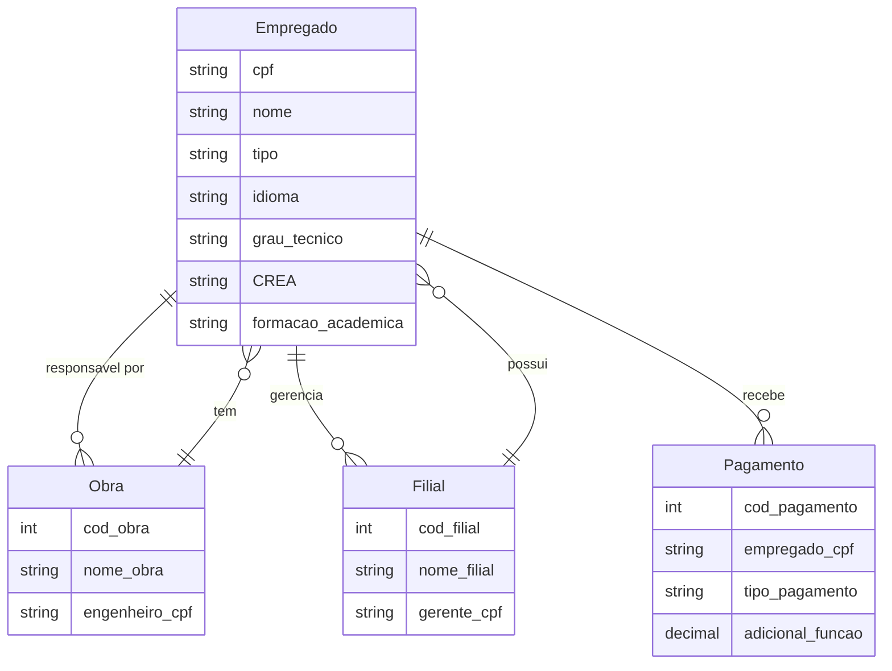
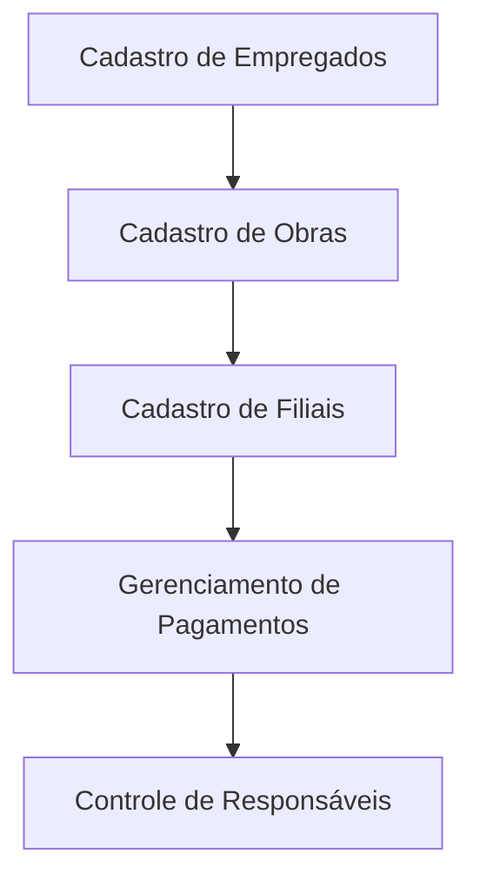

---

# Proposta de Projeto 2: Sistema de Gerenciamento de Empregados da Construtora

---

## Sumário

1. [Introdução](#introdução)
2. [Escopo do Projeto](#escopo-do-projeto)
3. [Requisitos do Sistema](#requisitos-do-sistema)
4. [Modelagem de Dados](#modelagem-de-dados)
5. [Diagrama de Conceito](#diagrama-de-conceito)
6. [Diagrama de Fluxo](#diagrama-de-fluxo)
7. [Próximos Passos](#próximos-passos)

---

## Introdução

Este projeto tem como objetivo desenvolver um sistema de gerenciamento de empregados para a construtora. O sistema permitirá o cadastro e controle de informações relevantes sobre os empregados, incluindo cargos, qualificações, e formas de pagamento.

## Escopo do Projeto

O escopo do projeto inclui:

- Cadastro de empregados com informações específicas para cada cargo.
- Gestão de obras e seus respectivos engenheiros responsáveis.
- Controle de filiais e gerentes associados.
- Registro de forma de pagamento e particularidades para cada tipo de empregado.

## Requisitos do Sistema

### Funcionalidades

1. **Cadastro de Empregados**:
   - CPF e nome do empregado.
   - Tipo de empregado (secretário, engenheiro, técnico em edificações).
   
2. **Informações Específicas**:
   - **Secretário**: Idioma falado.
   - **Engenheiro**: Número do CREA e formação acadêmica (caso seja gerente).
   - **Técnico em Edificações**: Grau técnico e possibilidade de atuar como engenheiro.

3. **Cadastro de Obras**:
   - Obra com um engenheiro responsável associado.
   
4. **Gerenciamento de Filiais**:
   - Cadastro de gerentes nas filiais, que podem ser engenheiros ou apenas gerentes.

5. **Sistema de Pagamento**:
   - Formas de pagamento: mensalista e horista.
   - Especificidades para gerentes/engenheiros (mensalistas e adicional de função).

### Não Funcionais

- Integridade referencial nas relações entre as tabelas.
- Capacidade de expansão para novos tipos de empregados ou obras.
- Segurança e controle de acesso ao sistema.

## Modelagem de Dados

### Tabela Empregados

| Campo               | Tipo de Dado   | Descrição                                   |
|---------------------|----------------|---------------------------------------------|
| cpf                 | VARCHAR(11)    | CPF do empregado                            |
| nome                | VARCHAR(100)   | Nome do empregado                           |
| tipo                | ENUM('secretário', 'engenheiro', 'técnico') | Tipo de empregado                     |
| idioma              | VARCHAR(50)    | Idioma (apenas para secretários)          |
| grau_tecnico        | VARCHAR(50)    | Grau técnico (apenas para técnicos)       |
| CREA                | VARCHAR(20)    | Registro do CREA (apenas para engenheiros) |
| formacao_academica  | VARCHAR(100)   | Formação acadêmica (apenas para gerentes) |

### Tabela Obras

| Campo         | Tipo de Dado   | Descrição                                   |
|---------------|----------------|---------------------------------------------|
| cod_obra      | INT            | Código da obra                              |
| nome_obra     | VARCHAR(100)   | Nome da obra                                |
| engenheiro_cpf| VARCHAR(11)    | CPF do engenheiro responsável               |

### Tabela Filiais

| Campo         | Tipo de Dado   | Descrição                                   |
|---------------|----------------|---------------------------------------------|
| cod_filial    | INT            | Código da filial                            |
| nome_filial   | VARCHAR(100)   | Nome da filial                              |
| gerente_cpf   | VARCHAR(11)    | CPF do gerente responsável                  |

### Tabela Pagamentos

| Campo            | Tipo de Dado   | Descrição                                   |
|------------------|----------------|---------------------------------------------|
| cod_pagamento     | INT            | Código do pagamento                         |
| empregado_cpf     | VARCHAR(11)    | CPF do empregado                            |
| tipo_pagamento    | ENUM('mensalista', 'horista') | Tipo de pagamento             |
| adicional_função   | DECIMAL(10,2)  | Adicional por função (apenas para gerentes/engenheiros) |

## Diagrama de Conceito

## Diagrama de Fluxo

## Próximos Passos

1. **Revisão dos requisitos**: Confirmar os detalhes com as partes interessadas.
2. **Modelagem detalhada**: Refinar os diagramas e tabelas de dados.
3. **Implementação**: Desenvolvimento do banco de dados e sistema.
4. **Testes**: Validar as funcionalidades do sistema.
5. **Treinamento**: Preparar usuários para o novo sistema.
6. **Manutenção**: Suporte contínuo ao sistema.

---
