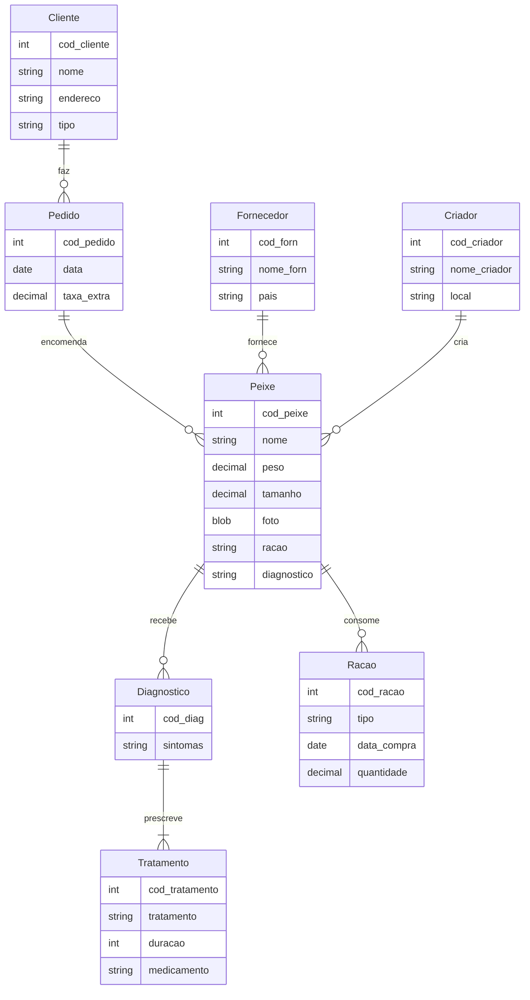
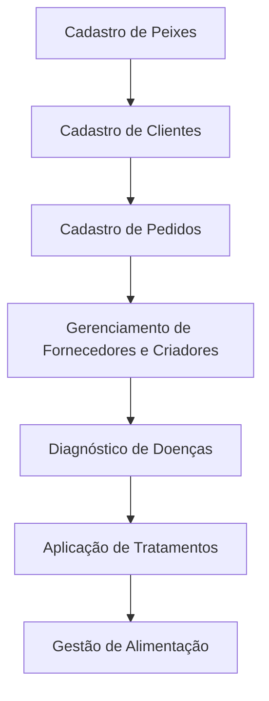

---

# Proposta de Projeto 1: Sistema de Banco de Dados para Empresa de Distribuição de Peixes Ornamentais (GoldFish)

---

## Sumário

1. [Introdução](#introdução)
2. [Escopo do Projeto](#escopo-do-projeto)
3. [Requisitos do Sistema](#requisitos-do-sistema)
4. [Modelagem de Dados](#modelagem-de-dados)
5. [Diagrama de Conceito](#diagrama-de-conceito)
6. [Diagrama de Fluxo](#diagrama-de-fluxo)
7. [Próximos Passos](#próximos-passos)

---

## Introdução

Este projeto visa desenvolver um sistema de banco de dados para a empresa GoldFish, que distribui peixes ornamentais. O sistema será capaz de gerenciar todo o ciclo de operações da empresa, incluindo cadastro de peixes, fornecedores, criadores, informações sobre alimentação, vendas, e a saúde dos peixes, com foco em diagnósticos e tratamentos. O objetivo é fornecer uma solução eficiente para armazenar e gerenciar todas essas informações de forma centralizada.

## Escopo do Projeto

O projeto engloba:

- Cadastro de peixes, incluindo informações sobre alimentação, peso, tamanho, e problemas de saúde.
- Gestão de fornecedores e criadores, relacionando cada um aos peixes que fornecem ou criam.
- Sistema de diagnóstico de doenças e tratamento de peixes, registrando os sintomas e o tratamento aplicado.
- Sistema de pedidos e clientes, incluindo o controle de pedidos que ainda não fazem parte do catálogo.

## Requisitos do Sistema

### Funcionalidades

1. **Cadastro de Peixes**:
   - Código, nome, peso, tamanho e fotografia.
   - Informações sobre alimentação e diagnóstico de saúde.
   
2. **Cadastro de Fornecedores e Criadores**:
   - Nome, endereço e relação com peixes fornecidos ou criados.
   
3. **Gestão de Diagnósticos e Tratamentos**:
   - Registro de diagnósticos com base nos sintomas apresentados pelos peixes.
   - Controle de tratamentos recomendados para cada diagnóstico.

4. **Cadastro de Clientes e Pedidos**:
   - Código do cliente, nome, endereço e tipo (varejista ou hobby).
   - Registro de pedidos e encomendas não catalogadas.

5. **Gestão de Alimentação**:
   - Controle de ração para cada peixe, com histórico de alimentação.

### Não Funcionais

- O sistema deve garantir integridade referencial entre as tabelas.
- O sistema deve ser escalável para acomodar novas espécies de peixes e clientes.
- Segurança do sistema com controle de acesso para diferentes tipos de usuários.

## Modelagem de Dados

### Tabela Peixes

| Campo      | Tipo de Dado   | Descrição                       |
|------------|----------------|---------------------------------|
| cod_peixe  | INT            | Código único do peixe           |
| nome       | VARCHAR(100)   | Nome do peixe                   |
| peso       | DECIMAL(5,2)   | Peso do peixe                   |
| tamanho    | DECIMAL(4,2)   | Tamanho do peixe                |
| foto       | BLOB           | Fotografia do peixe             |
| ração      | VARCHAR(200)   | Detalhes sobre a alimentação    |
| diagnostico| VARCHAR(200)   | Diagnóstico de saúde recente    |

### Tabela Fornecedores

| Campo      | Tipo de Dado   | Descrição                       |
|------------|----------------|---------------------------------|
| cod_forn   | INT            | Código único do fornecedor      |
| nome_forn  | VARCHAR(100)   | Nome do fornecedor              |
| país       | VARCHAR(50)    | País de origem                  |

### Tabela Criadores

| Campo      | Tipo de Dado   | Descrição                       |
|------------|----------------|---------------------------------|
| cod_criador| INT            | Código único do criador         |
| nome_criador | VARCHAR(100) | Nome do criador                 |
| local      | VARCHAR(200)   | Localização do criador          |

### Tabela Diagnóstico

| Campo         | Tipo de Dado   | Descrição                        |
|---------------|----------------|----------------------------------|
| cod_diag      | INT            | Código único do diagnóstico      |
| sintomas      | VARCHAR(255)   | Descrição dos sintomas           |
| cod_peixe     | INT            | Código do peixe diagnosticado    |
| cod_tratamento| INT            | Código do tratamento sugerido    |

### Tabela Tratamento

| Campo         | Tipo de Dado   | Descrição                        |
|---------------|----------------|----------------------------------|
| cod_tratamento| INT            | Código único do tratamento       |
| tratamento    | VARCHAR(255)   | Descrição do tratamento          |
| duracao       | INT            | Duração do tratamento (dias)     |
| medicamento   | VARCHAR(100)   | Medicamento utilizado            |

### Tabela Pedidos

| Campo      | Tipo de Dado   | Descrição                       |
|------------|----------------|---------------------------------|
| cod_pedido | INT            | Código único do pedido          |
| data       | DATE           | Data do pedido                  |
| taxa_extra | DECIMAL(5,2)   | Taxa extra (se aplicável)       |
| cod_cliente| INT            | Código do cliente associado     |

### Tabela Clientes

| Campo      | Tipo de Dado   | Descrição                       |
|------------|----------------|---------------------------------|
| cod_cliente| INT            | Código único do cliente         |
| nome       | VARCHAR(100)   | Nome do cliente                 |
| endereço   | VARCHAR(200)   | Endereço do cliente             |
| tipo       | VARCHAR(20)    | Tipo (varejista ou hobby)       |

### Tabela Ração

| Campo      | Tipo de Dado   | Descrição                       |
|------------|----------------|---------------------------------|
| cod_racao  | INT            | Código único da ração           |
| tipo       | VARCHAR(50)    | Tipo de ração                   |
| data_compra| DATE           | Data de compra da ração         |
| quantidade | DECIMAL(5,2)   | Quantidade de ração adquirida   |
| cod_peixe  | INT            | Código do peixe associado       |

## Diagrama de Conceito

## Diagrama de Fluxo

## Próximos Passos

1. **Revisão dos requisitos**: Verificar os detalhes com as partes interessadas.
2. **Modelagem detalhada**: Refinar os diagramas e tabelas de dados.
3. **Implementação**: Iniciar o desenvolvimento do banco de dados.
4. **Testes**: Validar as funcionalidades com testes completos.
5. **Treinamento**: Preparar os usuários para utilização do sistema.
6. **Manutenção**: Suporte contínuo e atualizações necessárias ao sistema.

---
