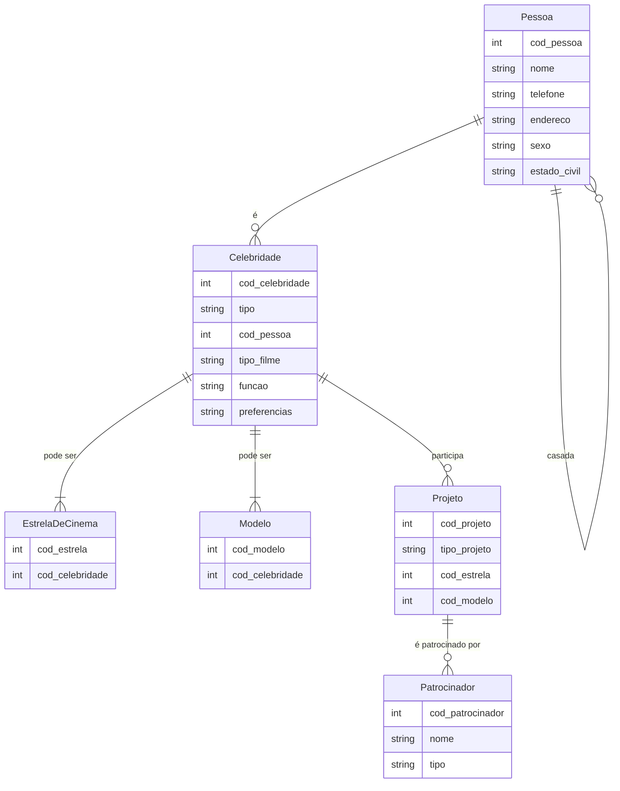
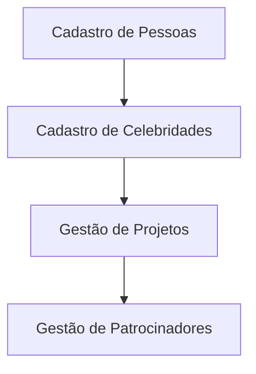

# Proposta de Projeto: Sistema de Banco de Dados para Automação de Cadastro de Projetos Cinematográficos (HollywoodDB)

## Sumário

1. [Introdução](#introdução)
2. [Escopo do Projeto](#escopo-do-projeto)
3. [Requisitos do Sistema](#requisitos-do-sistema)
4. [Modelagem de Dados](#modelagem-de-dados)
5. [Diagrama de Conceito](#diagrama-de-conceito)
6. [Diagrama de Fluxo](#diagrama-de-fluxo)
7. [Próximos Passos](#próximos-passos)

---

## Introdução

Este projeto visa desenvolver um sistema de banco de dados automatizado para a gestão de projetos cinematográficos na empresa HollywoodDB. O sistema permitirá o cadastro de pessoas, celebridades, projetos e patrocinadores, promovendo a automação do cadastro de projetos e gerenciamento dos profissionais envolvidos na produção.

## Escopo do Projeto

O projeto abrange:

- Cadastro de pessoas que trabalham no projeto, incluindo identificação, nome, telefone, endereço, sexo e estado civil.
- Gerenciamento de projetos cinematográficos e de modelagem, vinculando celebridades a cada tipo de projeto.
- Cadastro de patrocinadores, que podem ser pessoas físicas ou empresas, responsáveis pelo financiamento dos projetos de modelagem.
- Garantia da integridade referencial entre tabelas e flexibilidade para a adição de novos tipos de projetos e profissionais.

## Requisitos do Sistema

### Funcionalidades

1. **Cadastro de Pessoas**:
   - Armazenar informações como nome, telefone, endereço, sexo e estado civil.
   - Para casados, armazenar dados comuns e vincular as pessoas.

2. **Cadastro de Celebridades**:
   - Identificar celebridades como estrelas de cinema ou modelos.
   - Estrelas de cinema devem ter campo para tipo de filme e função.
   - Modelos devem ter campo para preferências de trabalho.

3. **Cadastro de Projetos**:
   - Projetos de filmes devem incluir pelo menos uma estrela de cinema.
   - Projetos de modelagem devem incluir pelo menos um modelo e, opcionalmente, patrocinadores.

4. **Cadastro de Patrocinadores**:
   - Cadastro de patrocinadores como pessoas físicas ou empresas, vinculados aos projetos de modelagem.

### Não Funcionais

- O sistema deve garantir a integridade referencial entre as tabelas.
- Deve suportar o cadastro de novos tipos de projetos e profissionais de forma escalável e eficiente.
- Segurança com controle de acesso para diferentes tipos de usuários.

## Modelagem de Dados

### Tabela Pessoas

| Campo         | Tipo de Dado   | Descrição                                |
|---------------|----------------|------------------------------------------|
| cod_pessoa    | INT            | Código único da pessoa                   |
| nome          | VARCHAR(100)   | Nome completo                            |
| telefone      | VARCHAR(20)    | Número de telefone                       |
| endereço      | VARCHAR(200)   | Endereço completo                        |
| sexo          | VARCHAR(10)    | Sexo                                    |
| estado_civil  | VARCHAR(20)    | Estado civil                             |

### Tabela Celebridades

| Campo         | Tipo de Dado   | Descrição                                |
|---------------|----------------|------------------------------------------|
| cod_celebridade| INT           | Código único da celebridade              |
| tipo          | VARCHAR(20)    | Tipo de celebridade (estrela de cinema, modelo) |
| cod_pessoa    | INT            | Código da pessoa associada               |
| tipo_filme    | VARCHAR(100)   | Gênero de filme para estrelas de cinema |
| funcao        | VARCHAR(50)    | Função para agentes de cinema           |
| preferencias  | VARCHAR(200)   | Preferências de trabalho para modelos    |

### Tabela EstrelaDeCinema

| Campo         | Tipo de Dado   | Descrição                                |
|---------------|----------------|------------------------------------------|
| cod_estrela   | INT            | Código único da estrela de cinema        |
| cod_celebridade| INT           | Código da celebridade associada          |

### Tabela Modelo

| Campo         | Tipo de Dado   | Descrição                                |
|---------------|----------------|------------------------------------------|
| cod_modelo    | INT            | Código único do modelo                   |
| cod_celebridade | INT          | Código da celebridade associada          |

### Tabela Projeto

| Campo         | Tipo de Dado   | Descrição                                |
|---------------|----------------|------------------------------------------|
| cod_projeto   | INT            | Código único do projeto                  |
| tipo_projeto  | VARCHAR(20)    | Tipo de projeto (filme, modelagem)      |
| cod_estrela   | INT            | Código da estrela de cinema associada    |
| cod_modelo    | INT            | Código do modelo associado               |

### Tabela Patrocinador

| Campo         | Tipo de Dado   | Descrição                                |
|---------------|----------------|------------------------------------------|
| cod_patrocinador| INT         | Código único do patrocinador             |
| nome          | VARCHAR(100)   | Nome do patrocinador                     |
| tipo          | VARCHAR(20)    | Tipo (pessoa ou empresa)                 |

## Diagrama de Conceito



## Diagrama de Fluxo



## Próximos Passos

1. **Revisão dos requisitos**: Verificar os detalhes do escopo com as partes interessadas.
2. **Modelagem detalhada**: Refinar os diagramas ER e fluxos de trabalho.
3. **Implementação**: Desenvolver as tabelas e relações no banco de dados.
4. **Testes**: Testar as funcionalidades do sistema com os cenários propostos.
5. **Treinamento**: Treinar os usuários finais no uso do sistema.
6. **Manutenção**: Garantir o suporte e a manutenção contínua do sistema.
```

Sinta-se à vontade para ajustar ou adicionar qualquer informação conforme necessário!
