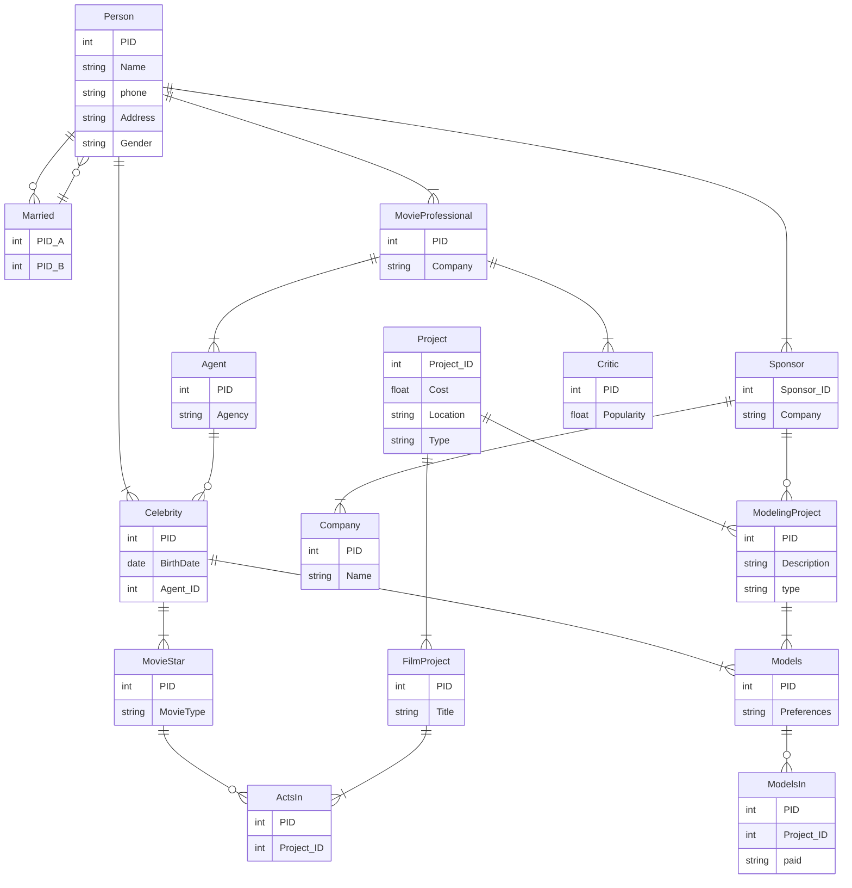
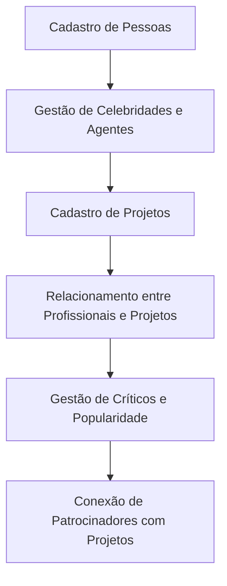

---

# Projeto: Sistema de Banco de Dados para Gerenciamento de Projetos e Celebridades (HollywoodDB)

## Sumário

1. [Introdução](#introdução)
2. [Escopo do Projeto](#escopo-do-projeto)
3. [Requisitos do Sistema](#requisitos-do-sistema)
4. [Modelagem de Dados](#modelagem-de-dados)
5. [Diagrama de Entidades](#diagrama-de-entidades)
6. [Próximos Passos](#próximos-passos)

---

## Introdução

Este projeto visa criar um banco de dados para o gerenciamento de celebridades, profissionais do setor cinematográfico e seus respectivos projetos. O sistema também permitirá o cadastro de patrocinadores e a modelagem de relações entre celebridades, agentes, patrocinadores e os projetos em que estão envolvidos.

## Escopo do Projeto

O sistema terá as seguintes funcionalidades principais:

- **Cadastro de pessoas** (celebridades, críticos, agentes, etc.).
- **Gerenciamento de casamentos** entre celebridades.
- **Cadastro de projetos** (filmes, modelagem, etc.) e suas informações.
- **Relação de profissionais da indústria com seus projetos** (atos em filmes, modelagem).
- **Gerenciamento de patrocinadores e suas conexões com projetos**.

## Requisitos do Sistema

### Funcionalidades

1. **Cadastro de Pessoas**:
   - Nome, telefone, endereço, e gênero.
   
2. **Cadastro de Casamentos**:
   - Relacionamento entre duas pessoas (casadas).
   
3. **Gerenciamento de Celebridades e Agentes**:
   - Celebridades e seus respectivos agentes, incluindo data de nascimento e agência.
   
4. **Gerenciamento de Projetos**:
   - Detalhes de projetos (como custo, localização, tipo).
   
5. **Profissionais do Cinema e Modelagem**:
   - Relação entre celebridades (como atores e modelos) com seus projetos.

6. **Cadastro de Críticos e Popularidade**:
   - Registro de críticos e sua popularidade no mercado.

7. **Relação com Patrocinadores**:
   - Conexão entre patrocinadores e os projetos de modelagem.

### Não Funcionais

- O sistema deve garantir integridade referencial entre as tabelas.
- O sistema deve ser escalável para acomodar mais projetos e novos tipos de profissionais no futuro.

## Modelagem de Dados

### Tabelas Principais

- **Person (Pessoa)**:
   - PID: Identificador único da pessoa.
   - Nome, Endereço, Telefone, Gênero.
   
- **Celebrity (Celebridade)**:
   - PID: Identificador da celebridade.
   - Data de nascimento, ID do agente.

- **Agent (Agente)**:
   - PID: Identificador do agente.
   - Agência associada.
   
- **Project (Projeto)**:
   - PID: Identificador do projeto.
   - Título, descrição, custo, localização, tipo de projeto (cinematográfico ou de modelagem).
   
- **Sponsor (Patrocinador)**:
   - Identificador de patrocinador (pessoa ou empresa).
   - Vinculado a um ou mais projetos.

- **MovieProfessional (Profissional de Cinema)**:
   - PID: Identificador do profissional.
   - Nome da empresa.
   
- **Critic (Crítico)**:
   - PID: Identificador do crítico.
   - Avaliação de popularidade.

### Relacionamentos

- **Married (Casamento)**: Relação entre duas pessoas.
- **ModelsIn (Participação de Modelos)**: Relação entre um modelo e os projetos nos quais está envolvido.
- **ActsIn (Atuação)**: Relação entre uma celebridade e os projetos cinematográficos.
- **Sponsors**: Relação entre patrocinadores e os projetos.

## Modelagem de Dados

### Tabela Person

| Campo     | Tipo de Dado   | Descrição                |
|-----------|----------------|--------------------------|
| PID       | INT            | Identificador único da pessoa |
| Name      | VARCHAR(100)   | Nome da pessoa           |
| phone     | VARCHAR(20)    | Telefone da pessoa       |
| Address   | VARCHAR(200)   | Endereço da pessoa       |
| Gender    | VARCHAR(10)    | Gênero da pessoa         |

### Tabela Married

| Campo     | Tipo de Dado   | Descrição                |
|-----------|----------------|--------------------------|
| PID_A     | INT            | Identificador da primeira pessoa casada |
| PID_B     | INT            | Identificador da segunda pessoa casada |

### Tabela Celebrity

| Campo     | Tipo de Dado   | Descrição                |
|-----------|----------------|--------------------------|
| PID       | INT            | Identificador único da celebridade |
| BirthDate | DATE           | Data de nascimento da celebridade |
| Agent_ID  | INT            | Identificador do agente responsável |

### Tabela Agent

| Campo     | Tipo de Dado   | Descrição                |
|-----------|----------------|--------------------------|
| PID       | INT            | Identificador único do agente |
| Agency    | VARCHAR(100)   | Agência que o agente representa |

### Tabela Project

| Campo       | Tipo de Dado   | Descrição                |
|-------------|----------------|--------------------------|
| Project_ID  | INT            | Identificador único do projeto |
| Cost        | DECIMAL(10,2)  | Custo do projeto          |
| Location    | VARCHAR(200)   | Localização do projeto    |
| Type        | VARCHAR(50)    | Tipo de projeto (filme, modelagem, etc.) |

### Tabela Sponsor

| Campo       | Tipo de Dado   | Descrição                |
|-------------|----------------|--------------------------|
| Sponsor_ID  | INT            | Identificador único do patrocinador |
| Company     | VARCHAR(100)   | Nome da empresa patrocinadora |

### Tabela MovieProfessional

| Campo     | Tipo de Dado   | Descrição                |
|-----------|----------------|--------------------------|
| PID       | INT            | Identificador único do profissional de cinema |
| Company   | VARCHAR(100)   | Empresa que representa o profissional |

### Tabela Critic

| Campo     | Tipo de Dado   | Descrição                |
|-----------|----------------|--------------------------|
| PID       | INT            | Identificador único do crítico |
| Popularity| DECIMAL(5,2)   | Popularidade do crítico   |

### Tabela MovieStar

| Campo     | Tipo de Dado   | Descrição                |
|-----------|----------------|--------------------------|
| PID       | INT            | Identificador único do astro de cinema |
| MovieType | VARCHAR(100)   | Tipo de filme que o astro atua |

### Tabela Models

| Campo       | Tipo de Dado   | Descrição                |
|-------------|----------------|--------------------------|
| PID         | INT            | Identificador único do modelo |
| Preferences | VARCHAR(100)   | Preferências do modelo   |

### Tabela ActsIn

| Campo       | Tipo de Dado   | Descrição                |
|-------------|----------------|--------------------------|
| PID         | INT            | Identificador do profissional (ator/atriz) |
| Project_ID  | INT            | Identificador do projeto no qual atua |

### Tabela FilmProject

| Campo     | Tipo de Dado   | Descrição                |
|-----------|----------------|--------------------------|
| PID       | INT            | Identificador do projeto de filme |
| Title     | VARCHAR(200)   | Título do projeto de filme |

### Tabela ModelsIn

| Campo       | Tipo de Dado   | Descrição                |
|-------------|----------------|--------------------------|
| PID         | INT            | Identificador do modelo   |
| Project_ID  | INT            | Identificador do projeto de modelagem |
| Paid        | VARCHAR(20)    | Indicação se o modelo foi pago ou não |

### Tabela Company

| Campo       | Tipo de Dado   | Descrição                |
|-------------|----------------|--------------------------|
| PID         | INT            | Identificador da empresa  |
| Name        | VARCHAR(100)   | Nome da empresa           |

### Tabela ModelingProject

| Campo        | Tipo de Dado   | Descrição                |
|--------------|----------------|--------------------------|
| PID          | INT            | Identificador do projeto de modelagem |
| Description  | VARCHAR(200)   | Descrição do projeto      |
| type         | VARCHAR(100)   | Tipo de modelagem         |

## Diagrama de Entidades

## Diagrama de Fluxo

## Próximos Passos

- Implementação do banco de dados usando as tabelas descritas.
- Criação de uma interface de usuário para gerenciar pessoas, projetos e relacionamentos.
- Integração do sistema com APIs externas para maior funcionalidade.

--- 
