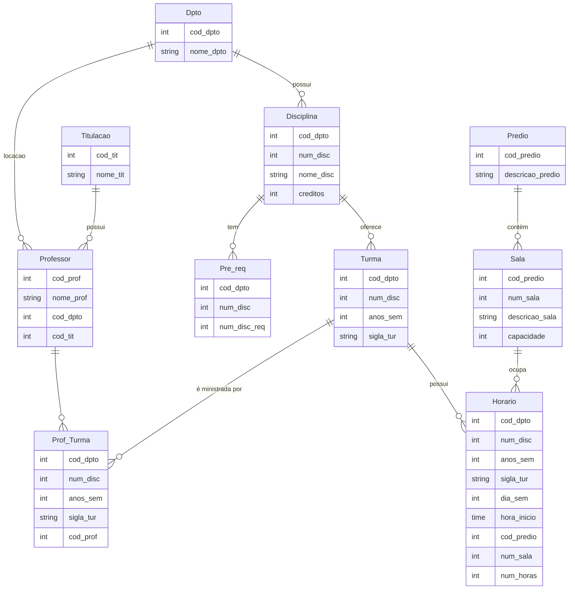
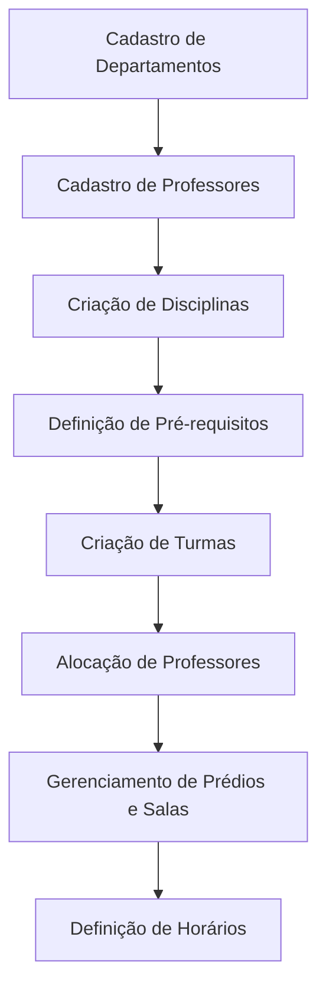

# Proposta de Projeto: Sistema de Banco de Dados para Gestão Acadêmica

## Sumário

1. [Introdução](#introdução)
2. [Escopo do Projeto](#escopo-do-projeto)
3. [Requisitos do Sistema](#requisitos-do-sistema)
4. [Modelagem de Dados](#modelagem-de-dados)
5. [Diagrama de Conceito](#diagrama-de-conceito)
6. [Diagrama de Fluxo](#diagrama-de-fluxo)
7. [Próximos Passos](#próximos-passos)

---

## Introdução

Este projeto tem como objetivo o desenvolvimento de um sistema de banco de dados normalizado e eficiente para gerenciar a estrutura acadêmica de uma universidade. O sistema será responsável pelo gerenciamento de professores, departamentos, disciplinas, turmas, prédios, salas, horários e pré-requisitos de disciplinas.

## Escopo do Projeto

O escopo do projeto inclui:

- Cadastro e gerenciamento de departamentos e professores.
- Criação de disciplinas e turmas associadas aos departamentos.
- Definição de pré-requisitos para disciplinas.
- Controle de prédios e salas para alocação de turmas.
- Gestão de horários para as aulas, incluindo dias, horários e localizações.

## Requisitos do Sistema

### Funcionalidades

1. **Cadastro de Departamentos:**
   - Código do departamento.
   - Nome do departamento.

2. **Cadastro de Titulação:**
   - Código da titulação.
   - Nome da titulação.

3. **Cadastro de Professores:**
   - Código do professor.
   - Nome do professor.
   - Código do departamento ao qual o professor pertence.
   - Titulação do professor.

4. **Criação de Disciplinas:**
   - Código do departamento.
   - Número da disciplina.
   - Nome da disciplina.
   - Créditos da disciplina.

5. **Definição de Pré-requisitos:**
   - Departamento e número da disciplina.
   - Número da disciplina que é pré-requisito.

6. **Criação de Turmas:**
   - Código do departamento.
   - Número da disciplina.
   - Ano e semestre da turma.
   - Sigla da turma.

7. **Alocação de Professores às Turmas:**
   - Código do professor.
   - Identificação da turma (departamento, disciplina, ano/semestre, sigla).

8. **Gerenciamento de Prédios e Salas:**
   - Código do prédio.
   - Número da sala.
   - Descrição e capacidade da sala.

9. **Definição de Horários:**
   - Identificação da turma.
   - Dia da semana.
   - Hora de início e duração.
   - Local (prédio e sala).

### Não Funcionais

- O sistema deve garantir a integridade referencial e o uso de chaves estrangeiras.
- Capacidade de escalabilidade para incluir novos departamentos, professores, disciplinas e turmas.
- O sistema deve ser seguro, permitindo controle de acesso e permissões adequadas para cada tipo de usuário.

## Modelagem de Dados

### Tabela Departamentos

| Campo      | Tipo de Dado   | Descrição                 |
|------------|----------------|---------------------------|
| cod_dpto   | INT            | Código do departamento     |
| nome_dpto  | VARCHAR(100)   | Nome do departamento       |

### Tabela Titulação

| Campo      | Tipo de Dado   | Descrição                 |
|------------|----------------|---------------------------|
| cod_tit    | INT            | Código da titulação        |
| nome_tit   | VARCHAR(100)   | Nome da titulação          |

### Tabela Professores

| Campo      | Tipo de Dado   | Descrição                 |
|------------|----------------|---------------------------|
| cod_prof   | INT            | Código do professor        |
| cod_dpto   | INT            | Código do departamento     |
| cod_tit    | INT            | Código da titulação        |
| nome_prof  | VARCHAR(100)   | Nome do professor          |

### Tabela Disciplinas

| Campo      | Tipo de Dado   | Descrição                 |
|------------|----------------|---------------------------|
| cod_dpto   | INT            | Código do departamento     |
| num_disc   | INT            | Número da disciplina       |
| nome_disc  | VARCHAR(100)   | Nome da disciplina         |
| creditos   | INT            | Créditos da disciplina     |

### Tabela Pré-requisitos

| Campo         | Tipo de Dado   | Descrição                       |
|---------------|----------------|---------------------------------|
| cod_dpto      | INT            | Código do departamento          |
| num_disc      | INT            | Número da disciplina            |
| num_disc_req  | INT            | Número da disciplina pré-requisito |

### Tabela Turmas

| Campo         | Tipo de Dado   | Descrição                       |
|---------------|----------------|---------------------------------|
| cod_dpto      | INT            | Código do departamento          |
| num_disc      | INT            | Número da disciplina            |
| anos_sem      | INT            | Ano e semestre                  |
| sigla_tur     | VARCHAR(10)    | Sigla da turma                  |

### Tabela Alocação de Professores nas Turmas

| Campo         | Tipo de Dado   | Descrição                       |
|---------------|----------------|---------------------------------|
| cod_dpto      | INT            | Código do departamento          |
| num_disc      | INT            | Número da disciplina            |
| anos_sem      | INT            | Ano e semestre                  |
| sigla_tur     | VARCHAR(10)    | Sigla da turma                  |
| cod_prof      | INT            | Código do professor             |

### Tabela Prédios

| Campo         | Tipo de Dado   | Descrição                       |
|---------------|----------------|---------------------------------|
| cod_predio    | INT            | Código do prédio                |
| descricao     | VARCHAR(100)   | Descrição do prédio             |

### Tabela Salas

| Campo         | Tipo de Dado   | Descrição                       |
|---------------|----------------|---------------------------------|
| cod_predio    | INT            | Código do prédio                |
| num_sala      | INT            | Número da sala                  |
| descricao     | VARCHAR(100)   | Descrição da sala               |
| capacidade    | INT            | Capacidade da sala              |

### Tabela Horários

| Campo         | Tipo de Dado   | Descrição                       |
|---------------|----------------|---------------------------------|
| cod_dpto      | INT            | Código do departamento          |
| num_disc      | INT            | Número da disciplina            |
| anos_sem      | INT            | Ano e semestre                  |
| sigla_tur     | VARCHAR(10)    | Sigla da turma                  |
| dia_sem       | INT            | Dia da semana                   |
| hora_inicio   | TIME           | Hora de início da aula          |
| cod_predio    | INT            | Código do prédio                |
| num_sala      | INT            | Número da sala                  |
| num_horas     | INT            | Duração da aula em horas        |

## Diagrama de Conceito

## Diagrama de Fluxo

## Próximos Passos

1. **Revisão dos Requisitos:** Confirmar detalhes com as partes interessadas.
2. **Modelagem Detalhada:** Criar diagramas mais detalhados e fluxos de dados.
3. **Implementação:** Desenvolver o banco de dados seguindo os conceitos de normalização.
4. **Testes e Validação:** Validar as funcionalidades conforme os requisitos estabelecidos.
5. **Treinamento:** Preparar os usuários para o uso do sistema.
6. **Manutenção:** Fornecer suporte contínuo e otimizações conforme necessário.

---

Este projeto visa garantir

 a organização e gestão eficaz do sistema acadêmico, proporcionando um ambiente funcional e intuitivo para seus usuários.
