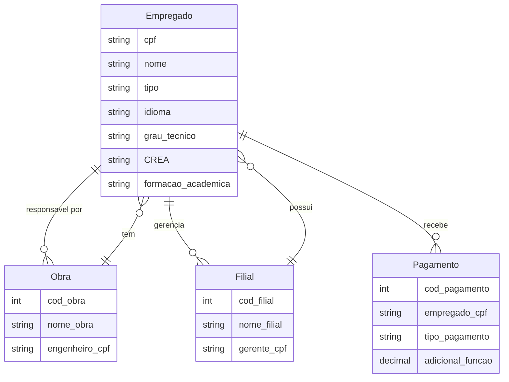
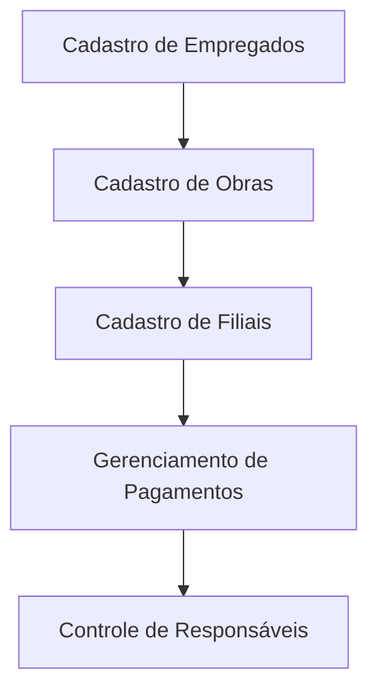

# Sistema de Gerenciamento de Empregados da Construtora

## Visão Geral

Este projeto visa criar um sistema robusto de gerenciamento de empregados para uma construtora. O sistema permite o cadastro e controle de informações relevantes sobre os empregados, incluindo cargos, qualificações e formas de pagamento.

## Funcionalidades Principais

- Cadastro de empregados com informações específicas para cada cargo
- Gestão de obras e seus respectivos engenheiros responsáveis
- Controle de filiais e gerentes associados
- Registro de forma de pagamento e particularidades para cada tipo de empregado

## Requisitos Técnicos

### Banco de Dados

O sistema utiliza um banco de dados relacional com as seguintes tabelas principais:

1. **Empregados**
   - cpf (VARCHAR(11))
   - nome (VARCHAR(100))
   - tipo (ENUM('secretário', 'engenheiro', 'técnico'))
   - idioma (VARCHAR(50)) (apenas para secretários)
   - grau_tecnico (VARCHAR(50)) (apenas para técnicos)
   - CREA (VARCHAR(20)) (apenas para engenheiros)
   - formacao_academica (VARCHAR(100)) (apenas para gerentes)

2. **Obras**
   - cod_obra (INT)
   - nome_obra (VARCHAR(100))
   - engenheiro_cpf (VARCHAR(11))

3. **Filiais**
   - cod_filial (INT)
   - nome_filial (VARCHAR(100))
   - gerente_cpf (VARCHAR(11))

4. **Pagamentos**
   - cod_pagamento (INT)
   - empregado_cpf (VARCHAR(11))
   - tipo_pagamento (ENUM('mensalista', 'horista'))
   - adicional_função (DECIMAL(10,2)) (apenas para gerentes/engenheiros)

## Diagrama de Conceito



## Diagrama de Fluxo



## Instalação e Configuração

1. Clone o repositório: `git clone https://github.com/seu_usuario/sistema-gerenciamento-empregados-construtora.git`
2. Navegue até o diretório do projeto: `cd sistema-gerenciamento-empregados-construtora`
3. Configure o ambiente de desenvolvimento conforme necessário
4. Execute os scripts de migração do banco de dados (ver seções abaixo)

## Uso

1. Inicie o sistema de gerenciamento de empregados
2. Acesse as diferentes funcionalidades através do menu principal:
   - Cadastro de Empregados
   - Cadastro de Obras
   - Cadastro de Filiais
   - Gerenciamento de Pagamentos
   - Controle de Responsáveis

## Scripts de Migração do Banco de Dados

1. Criação das tabelas: `./criar_tabelas.sql`
2. Preenchimento inicial com dados de exemplo: `./preencher_dados_exemplo.sql`

Execute estes scripts no seu ambiente de banco de dados para configurar o sistema.

## Testes

O sistema inclui testes unitários e de integração para garantir a funcionalidade correta. Execute os seguintes comandos para executar os testes:

```
./run_tests.sh
```

## Contribuição

Contribuações são bem-vindas! Para enviar uma proposta de alteração ou adicionar novas funcionalidades:

1. Fork este repositório
2. Crie sua branch (`git checkout -b feature/amazing-feature`)
3. Faça suas alterações
4. Comite as mudanças (`git commit -m 'Add some amazing feature'`)
5. Push para a branch (`git push origin feature/amazing-feature`)
6. Abra uma Pull Request

