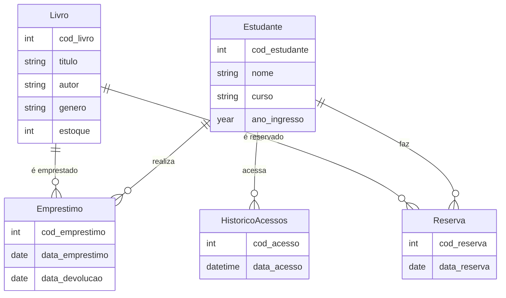
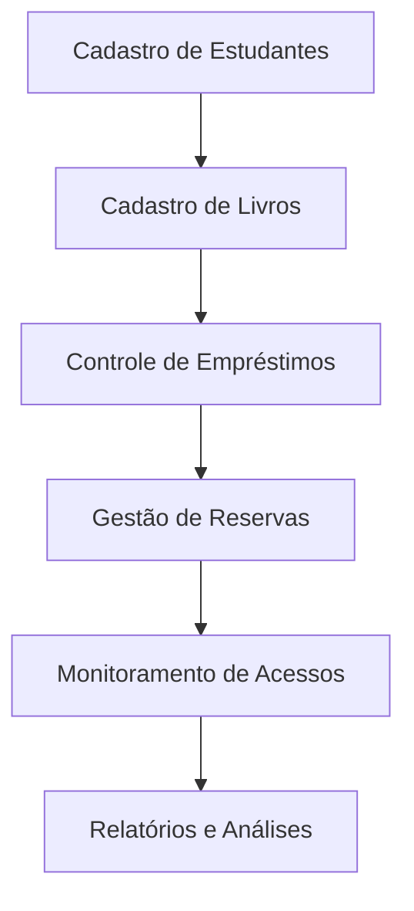

# Sistema de Gerenciamento de Biblioteca Universitária

---

## Sumário

1. [Introdução](#introdução)  
2. [Escopo do Projeto](#escopo-do-projeto)  
3. [Requisitos do Sistema](#requisitos-do-sistema)  
4. [Modelagem de Dados](#modelagem-de-dados)  
5. [Diagrama de Conceito](#diagrama-de-conceito)  
6. [Diagrama de Fluxo](#diagrama-de-fluxo)  
7. [Próximos Passos](#próximos-passos)  

---

## Introdução

Este projeto propõe um sistema de gerenciamento de biblioteca universitária para organizar e facilitar o controle de estudantes, livros, empréstimos, reservas e acessos. A proposta é oferecer uma solução centralizada e eficiente, garantindo o gerenciamento completo do acervo e dos usuários.

## Escopo do Projeto

O sistema engloba:

- Cadastro de livros com detalhes como título, autor, gênero e quantidade disponível.  
- Gerenciamento de estudantes, incluindo informações pessoais e acadêmicas.  
- Controle de empréstimos e reservas, com registro detalhado das datas e usuários.  
- Monitoramento de acessos à biblioteca e análise do uso por estudante.  
- Relatórios avançados, incluindo análises de uso de gêneros literários e popularidade.  

## Requisitos do Sistema

### Funcionalidades

1. **Cadastro de Livros**  
   - Código, título, autor, gênero e quantidade disponível no estoque.  

2. **Cadastro de Estudantes**  
   - Nome, curso, ano de ingresso e informações de contato.  

3. **Gestão de Empréstimos e Reservas**  
   - Controle de prazos, taxas de atraso e reservas realizadas.  

4. **Histórico de Acessos**  
   - Registro de acessos dos estudantes com data e hora.  

5. **Relatórios e Consultas Avançadas**  
   - Livros mais populares por gênero.  
   - Estudantes com mais acessos.  
   - Multas geradas por atrasos.  

### Requisitos Não Funcionais

- Garantir a integridade referencial entre tabelas.  
- Permitir acesso simultâneo a múltiplos usuários sem perda de dados.  
- Prover segurança com autenticação de usuários e controle de permissões.  

## Modelagem de Dados

### Tabela Livros

| Campo        | Tipo de Dado   | Descrição                       |  
|--------------|----------------|---------------------------------|  
| cod_livro    | INT            | Código único do livro          |  
| titulo       | VARCHAR(200)   | Título do livro                |  
| autor        | VARCHAR(100)   | Autor do livro                 |  
| genero       | VARCHAR(50)    | Gênero literário               |  
| estoque      | INT            | Quantidade disponível          |  

### Tabela Estudantes

| Campo         | Tipo de Dado   | Descrição                      |  
|---------------|----------------|--------------------------------|  
| cod_estudante | INT            | Código único do estudante     |  
| nome          | VARCHAR(100)   | Nome do estudante             |  
| curso         | VARCHAR(50)    | Curso acadêmico               |  
| ano_ingresso  | YEAR           | Ano de ingresso               |  

### Tabela Empréstimos

| Campo          | Tipo de Dado   | Descrição                      |  
|----------------|----------------|--------------------------------|  
| cod_emprestimo | INT            | Código único do empréstimo    |  
| cod_estudante  | INT            | Código do estudante           |  
| cod_livro      | INT            | Código do livro emprestado    |  
| data_emprestimo| DATE           | Data do empréstimo            |  
| data_devolucao | DATE           | Data de devolução             |  

### Tabela Reservas

| Campo         | Tipo de Dado   | Descrição                      |  
|---------------|----------------|--------------------------------|  
| cod_reserva   | INT            | Código único da reserva        |  
| cod_estudante | INT            | Código do estudante            |  
| cod_livro     | INT            | Código do livro reservado      |  
| data_reserva  | DATE           | Data da reserva                |  

### Tabela Histórico de Acessos

| Campo         | Tipo de Dado   | Descrição                      |  
|---------------|----------------|--------------------------------|  
| cod_acesso    | INT            | Código único do acesso         |  
| cod_estudante | INT            | Código do estudante            |  
| data_acesso   | DATETIME       | Data e hora do acesso          |  

---

## Diagrama de Conceito

---

## Diagrama de Fluxo

---

## Próximos Passos

1. **Revisão de requisitos**: Verificar com as partes interessadas para ajustes.  
2. **Implementação**: Desenvolver as tabelas e funcionalidades no banco de dados.  
3. **Testes**: Realizar testes de carga e validação dos dados.  
4. **Treinamento**: Preparar os usuários para operar o sistema.  
5. **Lançamento e manutenção**: Implantar o sistema e realizar ajustes contínuos conforme necessário.  

--- 
