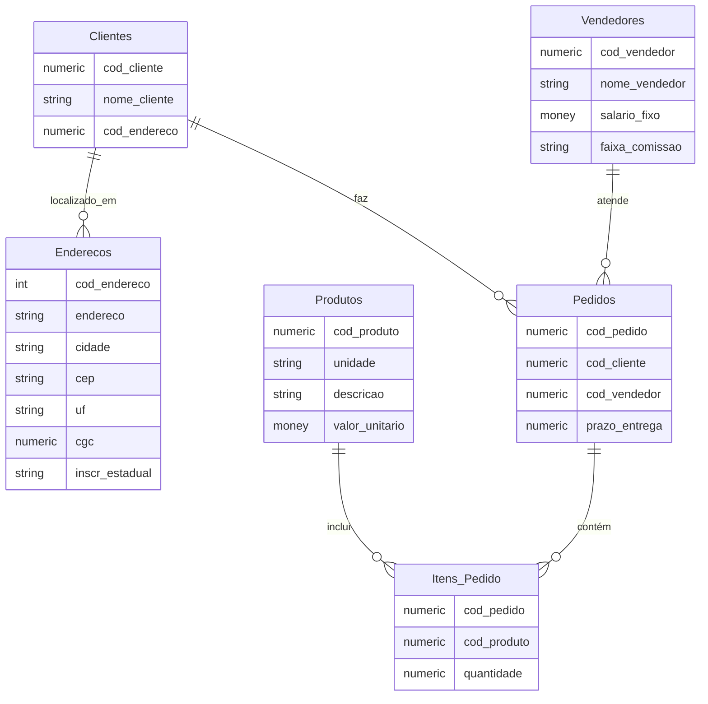
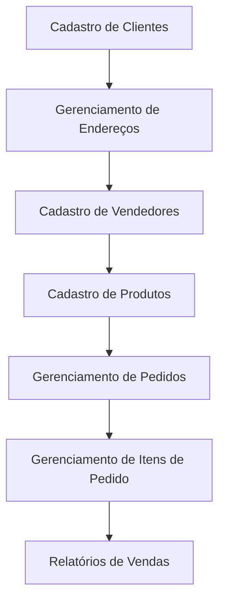

# Proposta de Projeto: Sistema de Banco de Dados para Gerenciamento de Mercado

## Sumário

1. [Introdução](#introdução)
2. [Escopo do Projeto](#escopo-do-projeto)
3. [Requisitos do Sistema](#requisitos-do-sistema)
4. [Modelagem de Dados](#modelagem-de-dados)
5. [Diagrama de Conceito](#diagrama-de-conceito)
6. [Diagrama de Fluxo](#diagrama-de-fluxo)
7. [Próximos Passos](#próximos-passos)

---

## Introdução

Este projeto visa desenvolver um banco de dados eficiente e normalizado para o gerenciamento de vendas em um mercado. Serão incluídos o cadastro e a gestão de clientes, vendedores, produtos e pedidos, além de uma tabela separada para endereços, permitindo uma estrutura mais organizada e normalizada, que promove a integridade dos dados e minimiza redundâncias.

## Escopo do Projeto

O escopo do projeto inclui:

- Cadastro e gerenciamento de clientes, vendedores e produtos.
- Separação de dados de endereço em uma tabela independente.
- Gerenciamento de pedidos e itens de pedidos.
- Relatórios de vendas e comissões.
- Controle de prazos de entrega.

## Requisitos do Sistema

### Funcionalidades

1. **Cadastro de Clientes:**
   - ID do cliente.
   - Nome completo.
   - Chave estrangeira para a tabela de endereços.

2. **Gerenciamento de Endereços:**
   - ID do endereço.
   - Endereço completo (rua, número, cidade, estado, CEP).
   - CGC e inscrição estadual.

3. **Cadastro de Vendedores:**
   - ID do vendedor.
   - Nome do vendedor.
   - Salário fixo.
   - Faixa de comissão.

4. **Cadastro de Produtos:**
   - ID do produto.
   - Descrição.
   - Unidade de medida.
   - Valor unitário.

5. **Gerenciamento de Pedidos:**
   - ID do pedido.
   - Prazo de entrega.
   - Chave estrangeira para cliente e vendedor.
   - Itens do pedido.

6. **Gerenciamento de Itens de Pedido:**
   - Chave estrangeira para pedido.
   - Chave estrangeira para produto.
   - Quantidade pedida.

### Não Funcionais

- Escalabilidade para grandes volumes de dados.
- Segurança e controle de acesso.
- Integração com sistemas de pagamento e controle de estoque.

## Modelagem de Dados

### Tabela Endereços

| Campo          | Tipo de Dado | Descrição                            |
|----------------|--------------|--------------------------------------|
| cod_endereco   | SERIAL       | Identificador único do endereço      |
| endereco       | Texto        | Rua e número do endereço             |
| cidade         | Texto        | Cidade do endereço                   |
| cep            | Texto        | Código postal                        |
| uf             | Texto        | Estado                               |
| cgc            | Numérico     | CGC                                  |
| inscr_estadual | Texto        | Inscrição estadual                   |

### Tabela Clientes

| Campo           | Tipo de Dado | Descrição                            |
|-----------------|--------------|--------------------------------------|
| cod_cliente     | Numérico     | Identificador único do cliente       |
| nome_cliente    | Texto        | Nome completo do cliente             |
| cod_endereco    | Numérico     | Chave estrangeira para tabela Endereços |

### Tabela Vendedores

| Campo            | Tipo de Dado | Descrição                            |
|------------------|--------------|--------------------------------------|
| cod_vendedor     | Numérico     | Identificador único do vendedor      |
| nome_vendedor    | Texto        | Nome do vendedor                     |
| salario_fixo     | Moeda        | Salário fixo do vendedor             |
| faixa_comissao   | Texto        | Faixa de comissão                    |

### Tabela Produtos

| Campo            | Tipo de Dado | Descrição                            |
|------------------|--------------|--------------------------------------|
| cod_produto      | Numérico     | Identificador único do produto       |
| unidade          | Texto        | Unidade de medida do produto         |
| descricao        | Texto        | Descrição do produto                 |
| valor_unitario   | Moeda        | Valor unitário do produto            |

### Tabela Pedidos

| Campo            | Tipo de Dado | Descrição                            |
|------------------|--------------|--------------------------------------|
| cod_pedido       | Numérico     | Identificador único do pedido        |
| prazo_entrega    | Numérico     | Prazo de entrega do pedido           |
| cod_cliente      | Numérico     | Chave estrangeira para Clientes      |
| cod_vendedor     | Numérico     | Chave estrangeira para Vendedores    |

### Tabela Itens de Pedido

| Campo            | Tipo de Dado | Descrição                            |
|------------------|--------------|--------------------------------------|
| cod_pedido       | Numérico     | Chave estrangeira para Pedidos       |
| cod_produto      | Numérico     | Chave estrangeira para Produtos      |
| quantidade       | Numérico     | Quantidade pedida                    |

## Diagrama de Conceito

## Diagrama de Fluxo

## Próximos Passos

1. **Revisão de Requisitos:** Revisar e confirmar os detalhes com as partes interessadas.
2. **Modelagem Detalhada:** Desenvolver diagramas de entidade-relacionamento (ERD) mais detalhados e fluxos de dados.
3. **Implementação:** Criar o banco de dados utilizando SQL, garantindo a normalização dos dados.
4. **Testes e Validações:** Realizar testes para validar o sistema e garantir que os requisitos foram atendidos.
5. **Treinamento e Implantação:** Treinar os usuários e lançar a solução.
6. **Manutenção:** Fornecer suporte contínuo e realizar melhorias conforme necessário.

---

Este projeto visa fornecer uma solução robusta e normalizada para o gerenciamento de vendas em um mercado, otimizando a gestão de clientes, vendedores e produtos, além de garantir o controle eficiente de pedidos e itens associados.
