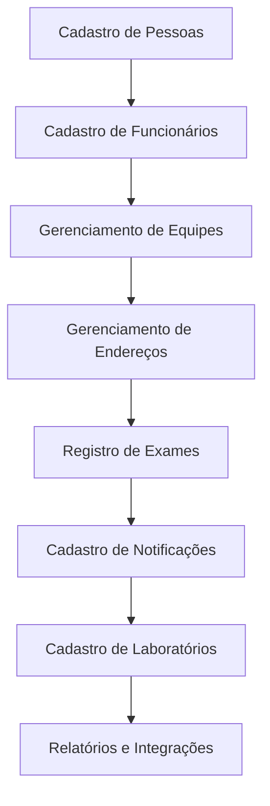

# Proposta de Projeto: Sistema de Banco de Dados para o Setor de Epidemiologia

## Sumário

1. [Introdução](#introdução)
2. [Escopo do Projeto](#escopo-do-projeto)
3. [Requisitos do Sistema](#requisitos-do-sistema)
4. [Modelagem de Dados](#modelagem-de-dados)
5. [Diagrama de Fluxo](#diagrama-de-fluxo)
6. [Próximos Passos](#próximos-passos)

---

## Introdução

Este projeto tem como objetivo desenvolver um banco de dados robusto para o setor de epidemiologia da cidade, permitindo o cadastro de pessoas, funcionários, equipes, endereços, exames, notificações e laboratórios. Além disso, será realizada a integração com dados de farmácias e clínicas para melhor monitoramento e controle de doenças.

## Escopo do Projeto

O escopo do projeto inclui:

- Cadastro e gerenciamento de pessoas e funcionários.
- Registro de exames e notificações.
- Cadastro e gerenciamento de laboratórios.
- Integração com farmácias e clínicas.
- Identificação de endereços em zonas rurais.
- Classificação de tipos de dengue e resultados de exames.

## Requisitos do Sistema

### Funcionalidades

1. **Cadastro de Pessoas e Funcionários:**
   - ID único.
   - Nome.
   - Data nascimento.
   - CPF
   - Categoria (funcionário ou geral).
   - Equipe e função para funcionários.

2. **Gerenciamento de Equipes:**
   - ID da equipe.
   - Setor responsável.

3. **Gerenciamento de Endereços:**
   - ID do endereço.
   - Chave estrangeira para pessoa.
   - Detalhes do endereço.

4. **Registro de Exames:**
   - ID do exame.
   - Chave estrangeira para pessoa.
   - Informe do exame (laboratório ou clínico).
   - Resultado (positivo ou negativo) e tipo de dengue.

5. **Cadastro de Notificações:**
   - ID da notificação.
   - Data e hora.
   - Sintomas reportados.
   - Origem (pessoa, laboratório, farmácia, clínica).
   - Chave estrangeira para laboratório e exame.

6. **Cadastro de Laboratórios:**
   - ID do laboratório.
   - Nome e localização.
   - Chave estrangeira para exames e notificações.

### Não Funcionais

- Segurança e integridade dos dados.
- Escalabilidade para um grande volume de informações.
- Integração eficiente com sistemas externos.

## Modelagem de Dados

**Tabela Pessoas**
| Campo        | Tipo de Dado  | Descrição                            |
|--------------|---------------|--------------------------------------|
| ID           | Inteiro       | Identificador único da pessoa        |
| Nome         | Texto         | Nome completo da pessoa              |
| Data_nasc    | Date          | Data de nascimento da pessoa         |
| CPF          | Inteiro       | CPF da pessoa                        |
| Categoria    | Texto         | Categoria (funcionário ou geral)     |

**Tabela Funcionários**
| Campo           | Tipo de Dado  | Descrição                             |
|-----------------|---------------|---------------------------------------|
| ID Funcionário  | Inteiro       | Identificador único do funcionário    |
| ID Pessoa       | Inteiro       | Chave estrangeira para a tabela Pessoas |
| Equipe          | Texto         | Equipe à qual o funcionário pertence  |
| Função          | Texto         | Função do funcionário                 |

**Tabela Equipes**
| Campo        | Tipo de Dado  | Descrição                            |
|--------------|---------------|--------------------------------------|
| ID Equipe    | Inteiro       | Identificador único da equipe        |
| Setor        | Texto         | Setor de responsabilidade da equipe  |

**Tabela Endereços**
| Campo            | Tipo de Dado  | Descrição                            |
|------------------|---------------|--------------------------------------|
| ID               | Inteiro       | Identificador único do endereço      |
| ID Pessoa        | Inteiro       | Chave estrangeira para pessoa        |
| Rua              | Texto         | Rua do endereço                      |
| Número           | Inteiro       | Número do endereço                   |
| Complemento      | Texto         | Complemento do endereço              |
| Bairro           | Texto         | Bairro do endereço                   |
| Cidade           | Texto         | Cidade do endereço                   |
| Estado           | Texto         | Estado do endereço                   |
| CEP              | Texto         | CEP do endereço                      |

**Tabela Exames**
| Campo            | Tipo de Dado  | Descrição                            |
|------------------|---------------|--------------------------------------|
| ID               | Inteiro       | Identificador único do exame         |
| ID Pessoa        | Inteiro       | Chave estrangeira para pessoa        |
| ID Lab           | Interio       | Chave estrangeira para laboratorio   |
| Data             | Date          | Data do exame                        |
| Informe          | Texto         | Tipo de informe (laboratório/clínico)|
| Resultado        | Texto         | Resultado do exame (positivo/negativo)|
| Tipo de Dengue   | Texto         | Tipo de dengue (1, 2 ou 3)           |

**Tabela Notificações**
| Campo              | Tipo de Dado  | Descrição                           |
|--------------------|---------------|-------------------------------------|
| ID                 | Inteiro       | Identificador único da notificação  |
| Data e Hora        | Data e Hora   | Data e hora da notificação          |
| Sintomas           | Texto         | Sintomas reportados                 |
| Origem             | Texto         | Origem da notificação               |
| ID Laboratório     | Inteiro       | Chave estrangeira para laboratórios |
| ID Exame           | Inteiro       | Chave estrangeira para exames       |

**Tabela Laboratórios**
| Campo             | Tipo de Dado  | Descrição                           |
|-------------------|---------------|-------------------------------------|
| ID                | Inteiro       | Identificador único do laboratório  |
| Nome              | Texto         | Nome do laboratório                 |
| Localização       | Texto         | Localização do laboratório          |
| Telefone          | Texto         | Telefone do laboratório             |
| Email             | Texto         | Email do laboratório                |

## Diagrama de Fluxo

## Próximos Passos

1. **Revisão de Requisitos:** Confirmar os detalhes com as partes interessadas.
2. **Modelagem Detalhada:** Criar diagramas de entidade-relacionamento (ERD) e diagramas de fluxo de dados.
3. **Implementação:** Desenvolver o banco de dados e a interface de usuário.
4. **Testes e Validações:** Garantir que todos os componentes funcionem corretamente.
5. **Treinamento e Implantação:** Treinar a equipe e implementar o sistema.
6. **Manutenção:** Fornecer suporte contínuo e atualizações conforme necessário.

---

Este documento serve como base para o desenvolvimento de um sistema de banco de dados eficiente para o setor de epidemiologia, visando melhorar o gerenciamento e o monitoramento de casos de dengue e outras doenças. A implementação desse projeto contribuirá para uma resposta mais rápida e eficiente às necessidades de saúde pública.
